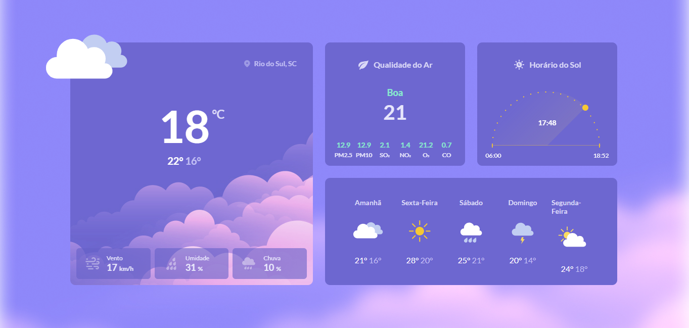

<h1 align="center"> #10 Página de Clima </h1>

Criação de uma página de clima é o #11 desafio <a href="https://boracodar.dev/">#BORACODAR</a> da RocketSeat 

  <a href="#🚀-tecnologias">Tecnologias</a>&nbsp;&nbsp;&nbsp;|&nbsp;&nbsp;&nbsp;
  <a href="#💻-projeto">Projeto</a>&nbsp;&nbsp;&nbsp;|&nbsp;&nbsp;&nbsp;
  <a href="#🔖-layout">Layout</a>&nbsp;&nbsp;&nbsp;|&nbsp;&nbsp;&nbsp;

 

  

## 🚀 Tecnologias

Esse projeto foi desenvolvido com as seguintes tecnologias:

- HTML
- CSS
- Git e Github
- Figma

## 💻 Projeto

O projeto _Login Page_ foi realizado como parte do #11 desafio #BORACODAR da RocketSeat sugerido pelo professor <a href="https://github.com/maykbrito" alt="Link para o GitHub do professor Mayk Brito" target="_blank">Mayk Brito</a>.

- [Acesse o projeto finalizado, online](https://jp-xaxa.github.io/pagina-clima-github-vscode/)

<h1 align="center">
  Funcionalidades
</h1>

O desafio foi a criação do layout de uma página com informações de login <a href="#🔖-layout">Layout</a>, além disso, o projeto possui:

- Pagina responsiva

## 🔖 Layout

Você pode visualizar o layout proposto pela RocketSeat através do da <a href="#-layout-figma">imagem abaixo</a>. Disponibilizado pelo [Figma](https://figma.com) durante o período do desafio.

  

